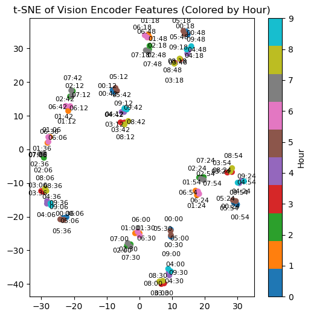
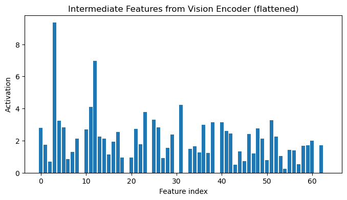

# Goal

The idea is to attempt to solve ARC using a vision-based approach. We'll first bench vision models for their vision reasoning abilities on ARC, and then attempt to train a visual "reasoning" model that is able to reason on the task somehow visually, using spatial arrangements in some useful way that we've encoded. 

One other idea is to try to work on in-context learning of visual representations! Maybe just making the embedding dimension really big and training a bit will make the model good at this.

Relevant papers:

https://arxiv.org/abs/2407.04973
https://ieeexplore.ieee.org/abstract/document/10650020
https://openaccess.thecvf.com/content/CVPR2024/html/Ganz_Question_Aware_Vision_Transformer_for_Multimodal_Reasoning_CVPR_2024_paper.html
https://arxiv.org/abs/2403.11401
https://ojs.aaai.org/index.php/AAAI/article/view/27888
https://arxiv.org/abs/2501.00070
https://arxiv.org/abs/2402.11574 (Super relevant! In-context learning of visual reps in VLMs)

A cool result that came out of the "training VLMs to predict the time on a clock" experiment:

In this experiment, we trained a toy VLM to learn to tell time from a clock. These clocks are really simple, only ever having the hour and minute hands unrealistically pointing directly at numbers (never between numbers, even when they should, ex. at 1:45 the hour hand should be 3/4 of the way between 1 and 2).

The clock has 10 hour denominations of 6 minutes each, and the model is trained with an 80/20 split on the 100 images in the dataset. Performing dimensionality reduction after the vision encoder layer (before the input text has been processed), we find the model clusters clocks by both hour and minute. Each of the ten different minute endings are in vague clusters of their own, and within these, we have mini clusters of 4 with two clocks of hour x and two clocks of hour x+5.

Also interesting to see there is certainly an imbalance in how much various features are represented...

